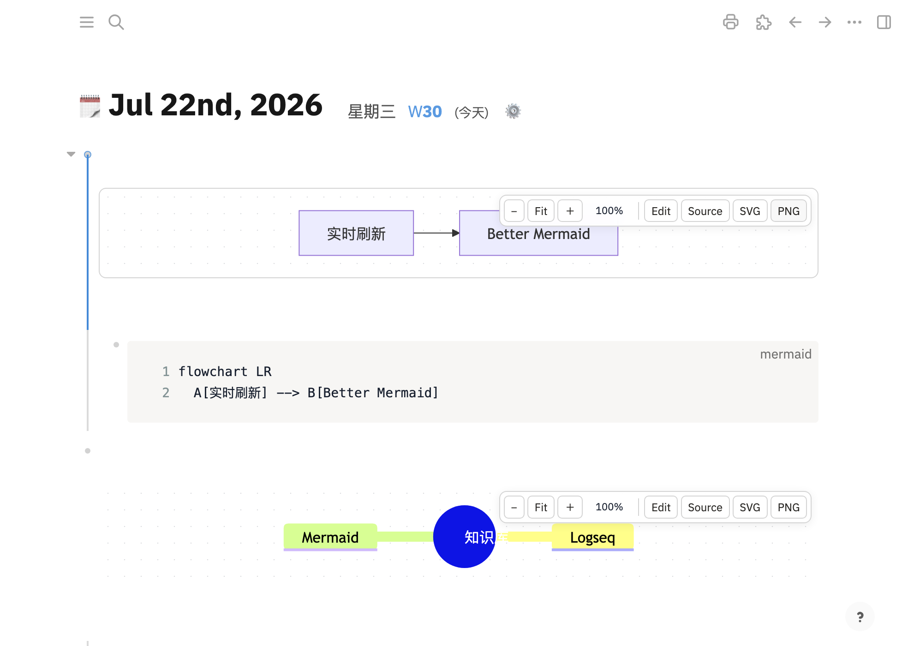

# Better Mermaid for Logseq

一个快速、离线、可交互的 Logseq Mermaid 查看器和编辑器。

[English](./README.md)



## 功能

- 使用 Mermaid 11 在本地生成 SVG，不访问在线渲染服务。
- 交互画布：滚轮缩放、鼠标拖动、双击适应，并保留每张图的视图状态。
- 内置 Monaco Editor，支持 Mermaid 高亮、行号、查找和键盘快捷键。
- 支持 flowchart、sequence、class、state、ER、Gantt、mindmap、timeline 等图表。
- 跟随 Logseq 明暗主题，支持行内错误、SVG 导出和高清 PNG 导出。
- UI 支持英文、简体中文和繁体中文，并跟随 Logseq 的首选语言。
- 可继续显示旧插件留下的 `{{renderer :mermaid_UUID}}` 宏。

## 使用

在 Logseq 中输入 `/Better Mermaid: 插入图表`。插件会创建：

````markdown
- {{renderer :better-mermaid}}
  - ```mermaid
    flowchart LR
      A[想法] --> B[Better Mermaid]
    ```
````

Mermaid 源码仍是标准子代码块。点击图表工具栏中的 **编辑** 可打开 Monaco Editor，也可以直接编辑下面的代码块。

## 本地安装

1. 运行 `bun install && bun run build`。
2. 在 Logseq 设置中启用 Developer mode。
3. 打开 Plugins，选择 **Load unpacked plugin**，然后选择本仓库。

也可以从 GitHub Releases 下载 `logseq-better-mermaid-0.1.3.zip`，解压后通过 Load unpacked plugin 安装。

## 验证

```bash
bun install
bun run test
bun run build
bun run test:e2e
```

端到端测试以 headless 模式启动隔离的 Logseq 0.10.12，不显示窗口，也不会访问真实笔记 graph。

## 隐私与安全

渲染和编辑过程不包含网络请求，Mermaid 与 Monaco 均随插件打包。默认使用 Mermaid `strict` 安全级别；只应为可信笔记启用 `loose`。

## 许可证

[MIT](./LICENSE)
